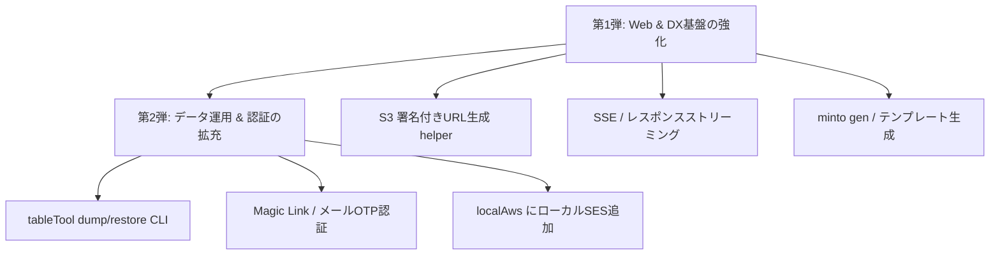

# minto 今後の機能拡張・改善アイデア検討メモ

mintoの設計思想（**「AIネイティブ・固定費ほぼ0円・超軽量(LLRT+128MB)・安全」**）および現在の実装状況を踏まえ、今後追加を検討すべき機能・拡張のアイデアを整理したメモです。

---

## 🧭 現状の強みと今後の強化ポイント

| カテゴリ | 現在の強み | 今後強化できるポイント |
|---|---|---|
| **AIネイティブ & DX** | `.mt.js` / `.jhtml.js` のシンプル構造、ローカル検証環境 | プロンプト用テンプレート生成、自動型定義・スキーマ出力 |
| **Webアプリ・API** | 動的JS実行、JHTML SSR、multipart対応 | S3署名付きURL生成（6MB制限回避）、SSE/Streaming |
| **データ永続化 (S3Table)** | `s3MasterTable` / `s3IndexTable` による固定費0円DB | S3テーブルのバックアップ/エクスポート/リストアCLI |
| **認証 & セキュリティ** | IP制限、GAS擬似SSO、S3セッション、MFA(TOTP) | パスワードレス（Magic Link / OTP）、ロール認可 (RBAC) |
| **運用 & ローカル環境** | `localAws.js`（S3/SQSエミュレータ）、LLRT互換性チェック | ローカルSES（擬似メールボックス）、構造化ログ/エラー通知 |

---

## 💡 機能拡張アイデア一覧

### 1. 🚀 Webアプリ・API機能の拡張（高優先度）

1. **S3 署名付きURL（Pre-signed URL）生成モジュール**
   - **背景**: Lambda Function URLのペイロード上限は **6MB** のため、画像やPDFなどの大容量ファイルアップロードは直接S3へ送信（Direct to S3）するのが定石。
   - **追加機能**: `modules/s3table/s3sdk.js` または新モジュールで `@aws-sdk/s3-request-presigner` 相当（または手動SigV4署名による超軽量生成）の `createPresignedPutUrl` / `createPresignedGetUrl` を提供。
   - **メリット**: 128MBメモリのLambdaでも大容量ストレージ連携が可能になる。

2. **Server-Sent Events (SSE) / レスポンスストリーミング対応**
   - **背景**: AWS Lambda Function URL はレスポンスストリーミング（`responseStream`）をサポート。AIチャットボット（Claude/ChatGPTの逐次テキスト表示）やリアルタイム進捗通知に必須。
   - **追加機能**: `.mt.js` でストリーミング出力やSSE（`text/event-stream`）を簡単に返せるレスポンスヘルパー（`$response().stream(...)` または `$response().sse(...)`）。

3. **簡易レートリミット（Rate Limiting / Throttling）**
   - **背景**: WAFを導入すると月額固定費（$5〜）が発生し「固定費0円」の思想と相反する。
   - **追加機能**: メモリ内キャッシュ（短期IP別カウント）または `s3Lock.js` / S3を活用したスライディングウィンドウ型レートリミットヘルパー。ブルートフォースやDDoSの初動を防御。

---

### 2. 🤖 AI Native & 開発者体験 (DX) の強化（高優先度）

1. **プロジェクト / CRUD 雛形ジェネレーター (`minto create` / `minto gen`)**
   - **背景**: `initMinto` は最小セットを作るが、AIや開発者が「S3Tableを使った一覧・詳細・登録画面」「GAS認証付き社内ツール」を1コマンドで立ち上げられると開発スピードが劇的に向上。
   - **追加機能**: 
     - `minto init --template gas-auth`
     - `minto gen crud <tableName> --fields "title:string, price:int"`（`.mt.js` と JHTML 画面を自動生成）

2. **OpenAPI / JSDoc からのAPI定義・TypeScript型自動生成**
   - **背景**: `modules/validate/validate.js` のスキーマ定義から、フロントエンド用の型定義（`.d.ts`）や OpenAPI (Swagger) JSON を自動出力。
   - **メリット**: AIがフロントエンド（Vanilla JS / React / Vue等）を書く際の精度が向上。

3. **ブラウザ自動更新（LiveReload）（※低優先度）**
   - **現状**: minto のローカルサーバー（`minto` コマンド）はリクエスト毎にファイルを動的読み込みするため、**サーバー再起動不要で即座に変更が反映されます**。
   - **検討事項**: エディタ保存時にブラウザ側をF5操作なしで自動再読み込みさせるSSEベースの軽量LiveReloadの追加要否（必要性が低ければ見送り）。

---

### 3. 📦 データストア (S3Table) の運用強化（中優先度）

1. **S3Table バックアップ・エクスポート・リストア CLI (`tableTool dump / restore`)**
   - **背景**: S3MasterTable / S3IndexTable のデータを JSONL や CSV 形式でローカルへ一括エクスポート、または本番環境へリストアする仕組み。
   - **追加機能**: `bin/tableTool dump <tableName>`, `bin/tableTool restore <tableName> <file>`

2. **ページネーション＆カーソル検索ヘルパー**
   - **背景**: `s3IndexTable` で件数が多い場合の「次へ」「前へ」のカーソルベースページネーション（Base64トークン化など）を標準化。

3. **タイムスタンプ・論理削除の自動処理オプション**
   - **背景**: `createdAt`, `updatedAt`, `deletedAt`（ソフトデリート）を各テーブル操作時に自動管理するプラグイン/設定。

---

### 4. 🔒 認証・セキュリティの拡充（中優先度）

1. **Magic Link / ワンタイムパスコード (OTP) 認証モジュール**
   - **背景**: Google Workspace未導入の環境でも、メールアドレス（SES連携）だけでパスワードレスログインを実現。
   - **追加機能**: 短期トークンを発行し、SESでメール送信 ➔ リンククリックで S3 セッション確立。

2. **ロールベース認可 (RBAC) ヘルパー**
   - **背景**: `filter.mt.js` や各 `.mt.js` 内で `admin`, `editor`, `viewer` などの権限チェックを簡潔に行うガード関数。
   - **例**: `$auth.requireRole(["admin"])`

3. **Webhook用 APIキー認証 / HMAC署名検証ヘルパー**
   - **背景**: GitHub, Stripe, Slack などの外部Webhookを受信する際のHMAC署名検証（`crypto.subtle` 利用でLLRT互換）。

---

### 5. 🛠 運用監視 & ローカルAWSエミュレータ拡張（低〜中優先度）

1. **ローカルSESエミュレータ（擬似メールボックス）**
   - **背景**: `localAws.js` はS3/SQSをサポートしているが、SESの `sendMail` もローカルでインターセプトし、送信内容をローカルHTML（`http://localhost:9911/__mail`）やログでプレビュー可能にする。

2. **構造化ログ & 一元化エラー通知ヘルパー (`$log`, `$notifyError`)**
   - **背景**: CloudWatch Logs Insights で解析しやすい JSON ログ出力と、例外発生時に自動で Slack / Discord / GitHub Issue へ通知するラッパー。

3. **0円運用監視テンプレート（AWS CLI / SAM / CloudFormation）**
   - **背景**: Lambda Function URL、S3バケット、AWS Budgets（月額$1超過でアラート）を一発デプロイできるスクリプト/IaC設定。

---

## 🎯 着手ロードマップ案

